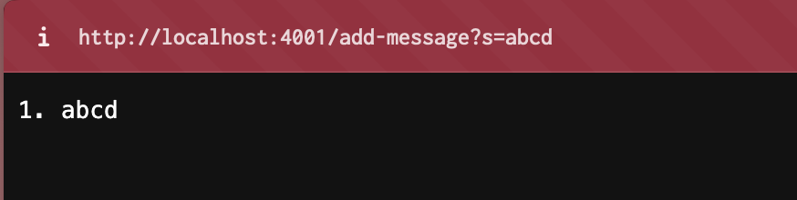
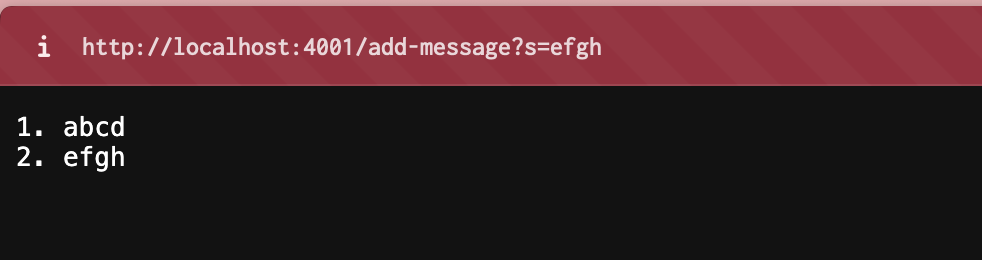
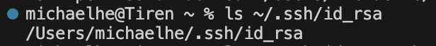
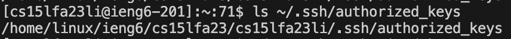
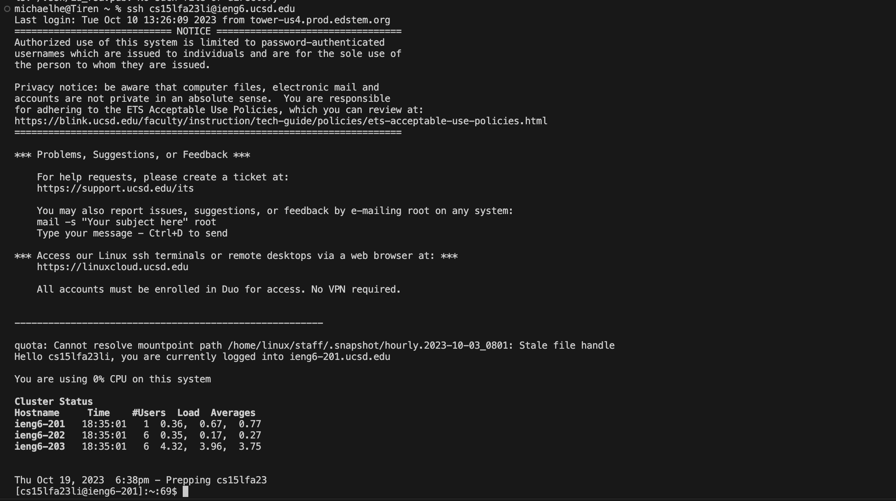

# Lab Report 2

## Part 1

### `StringServer` code:
```
import java.io.IOException;
import java.net.URI;
import java.util.ArrayList;

class Handler implements URLHandler {
    // The one bit of state on the server: a number that will be manipulated by
    // various requests.
    ArrayList<String> added = new ArrayList<String>();

    public String handleRequest(URI url) {
        if(url.getPath().equals("/")){
            String returns = "";
            for(int i = 0; i < added.size(); i++){
                returns = returns + (1+i) + ". " + added.get(i) + "\n";
            }
            return returns;
        }
        else if (url.getPath().equals("/add-message")) {
            String[] parameters = url.getQuery().split("=");
                if (parameters[0].equals("s")) {
                    added.add(parameters[1]);
                    String returns = "";
                    for(int i = 0; i < added.size(); i++){
                        returns = returns + (1+i) + ". " + added.get(i) + "\n";
                    }
                    return returns;
                }
            } 
            return "404 Not Found!";
        }
}

class StringServer {
    public static void main(String[] args) throws IOException {
        if(args.length == 0){
            System.out.println("Missing port number! Try any number between 1024 to 49151");
            return;
        }

        int port = Integer.parseInt(args[0]);

        Server.start(port, new Handler());
    }
}

```

### First `/add-message`


* Which methods in your code are called?
  
  The `handleRequest` method is called. 
* What are the relevant arguments to those methods, and the values of any relevant fields of the class?
  
  The argument of the `handleRequest` method is the URI `url`, and the field in the class is the `ArrayList` variable `added`. This stores all the messages added with `/add-message`. There are also important variables in the method, like the String `returns` which outputs the values added, and the array `parameters`, which takes in the query after the path and splits it into the `s` and the value added. 
* How do the values of any relevant fields of the class change from this specific request? If no values got changed, explain why.
  
  The ArrayList `added` goes from being empty to having a new element at index 0, `skdjf`. Other variables are not fields because they do not belong to the overall class. 

### Second `/add-message`


* Which methods in your code are called?
  
  The `handleRequest` method is called. 
* What are the relevant arguments to those methods, and the values of any relevant fields of the class?
  
  The argument of the `handleRequest` method is the URI `url`, and the field in the class is the `ArrayList` variable `added`. This stores all the messages added with `/add-message`. There are also important variables in the method, like the String `returns` which outputs the values added, and the array `parameters`, which takes in the query after the path and splits it into the `s` and the value added. 
* How do the values of any relevant fields of the class change from this specific request? If no values got changed, explain why.
  
  The ArrayList `added` goes from having one element at index 0 to having 2 elements, `skdjf` and `kesdhdfi2`. Other variables are not fields because they do not belong to the overall class.

## Part 2

### Path to private key


### Path to public key


### SSH login with no password: 


## Part 3

While most of the topics covered in Week 2 were topics I learned before, this week I learned how you can use commands to make it so that a your personal computer can access a remote shell without need to enter a password every time. I think this is very interesting because I used to be very into RSA encryption. While the public key is still encrypted, I think it's interesting that from the public key, you can figure out the private key. 
