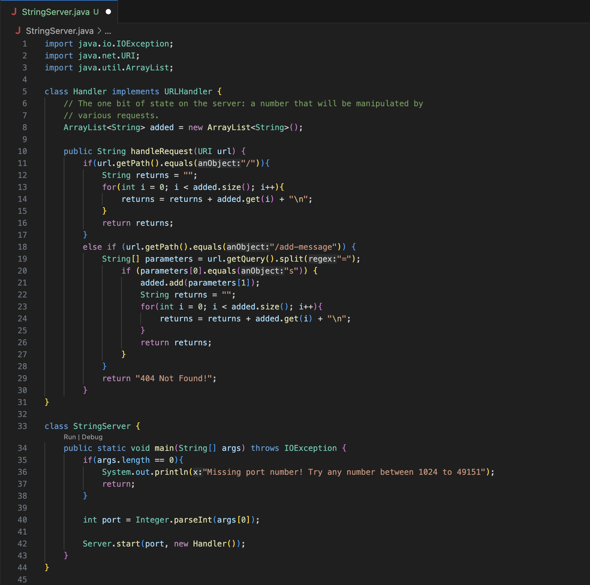
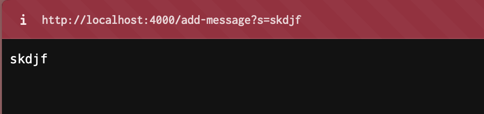
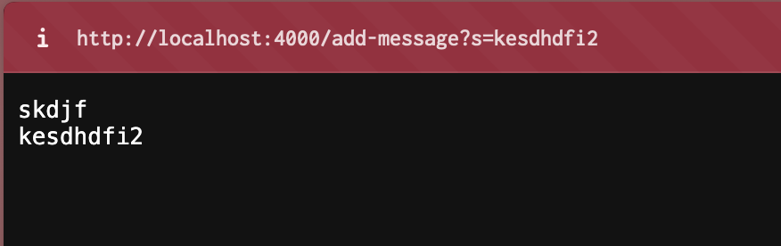

# Lab Report 2

## Part 1

### `StringServer` code:

### First `/add-message`

* Which methods in your code are called?
  The `handleRequest` method is called. 
* What are the relevant arguments to those methods, and the values of any relevant fields of the class?
  The argument of the `handleRequest` method is the URI `url`, and the field in the class is the `ArrayList` variable `added`
* How do the values of any relevant fields of the class change from this specific request? If no values got changed, explain why.

### Second `/add-message`

