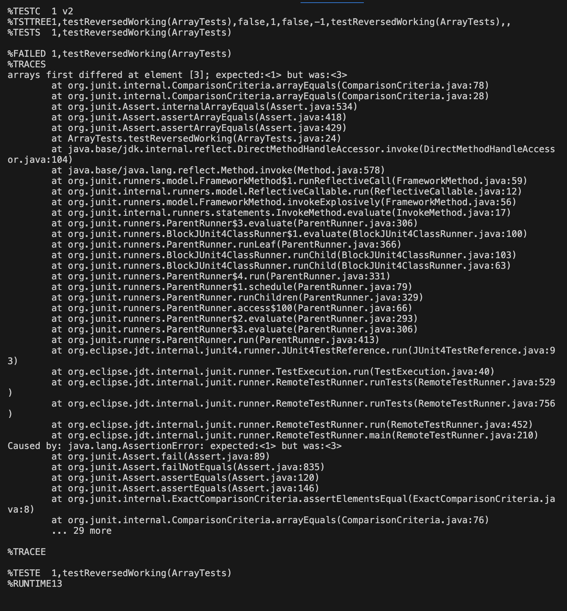
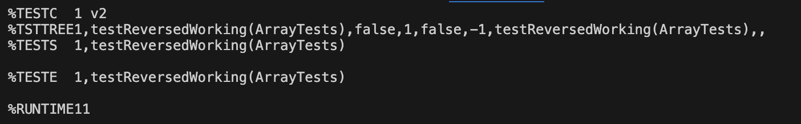

# Lab 3

## Part 1 - Bugs

### Bug with reverseInPlace

#### Failure inducing input: 
input: {0,1,2,3,4} expected: {4,3,2,1,0} output: {4,3,2,3,4}
```
@Test 
  public void testReversedWorking(){
      int[] input = {0,1,2,3,4};
      int[] output = {4,3,2,1,0};
      ArrayExamples.reverseInPlace(input);
      assertArrayEquals(output, input);
  }
```
#### Passing input: 
input: {0} expected: {0} output: {0}
```
@Test 
  public void testReversedWorking(){
      int[] input = {0};
      int[] output = {0};
      ArrayExamples.reverseInPlace(input);
      assertArrayEquals(output, input);
  }
```
#### Symptoms:
##### Failing Input:

##### Passing Input:


#### Buggy Code:
```
static void reverseInPlace(int[] arr) {
    for(int i = 0; i < arr.length/2; i += 1) {
        arr[i] = arr[arr.length - i - 1];
        arr[arr.length - i - 1] = arr[i];
    }
  }
```
#### Fixed Code: 
```
static void reverseInPlace(int[] arr) {
    for(int i = 0; i < arr.length/2; i += 1) {
        int temp = arr[i];
        arr[i] = arr[arr.length - i - 1];
        arr[arr.length - i - 1] = temp;
    }
  }
```


