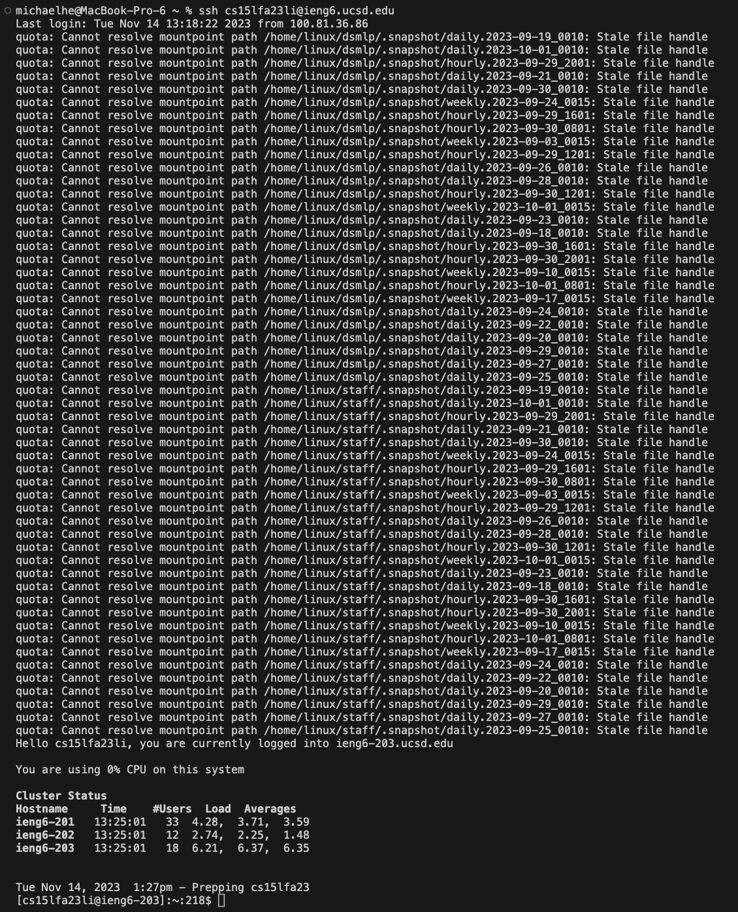
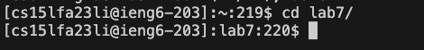
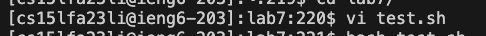
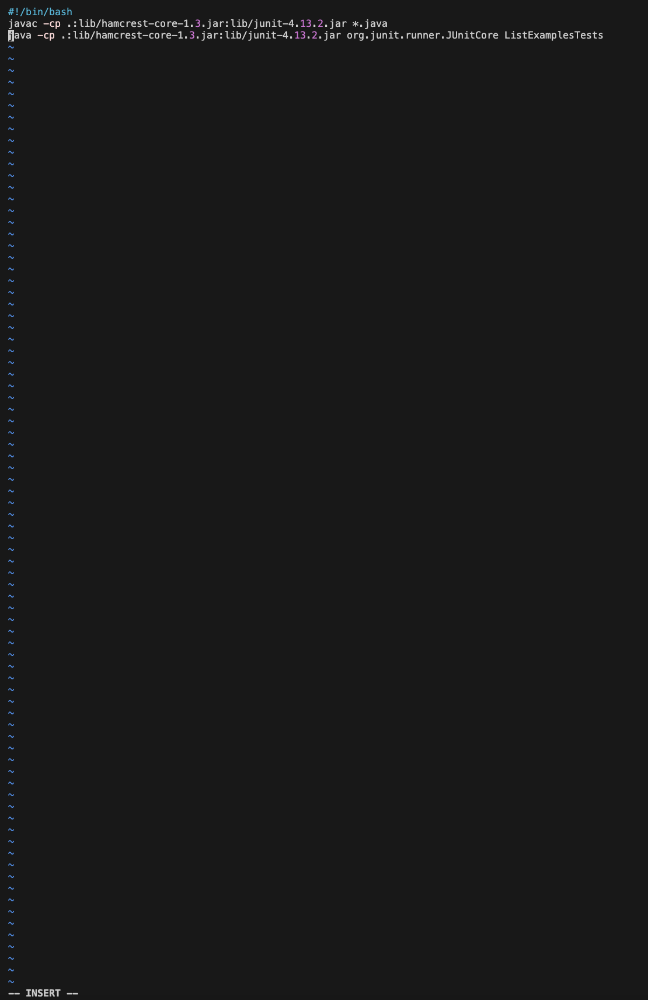
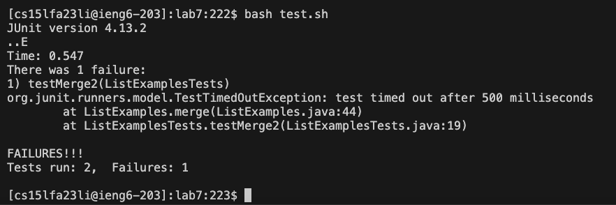
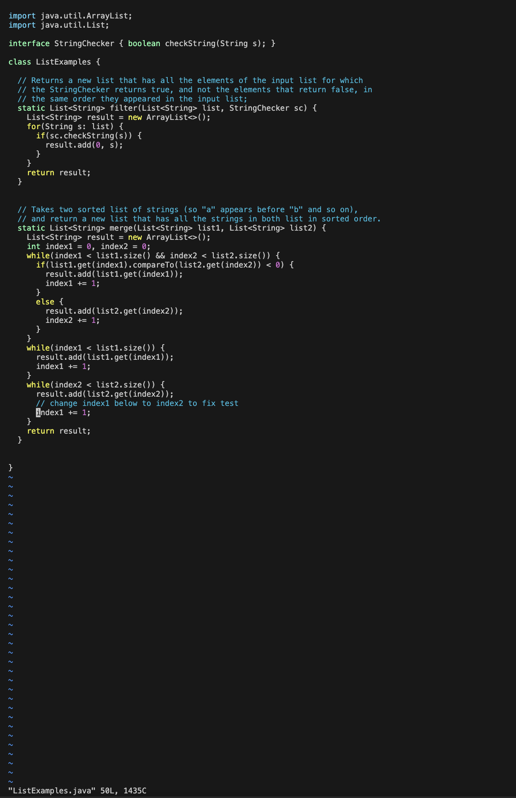
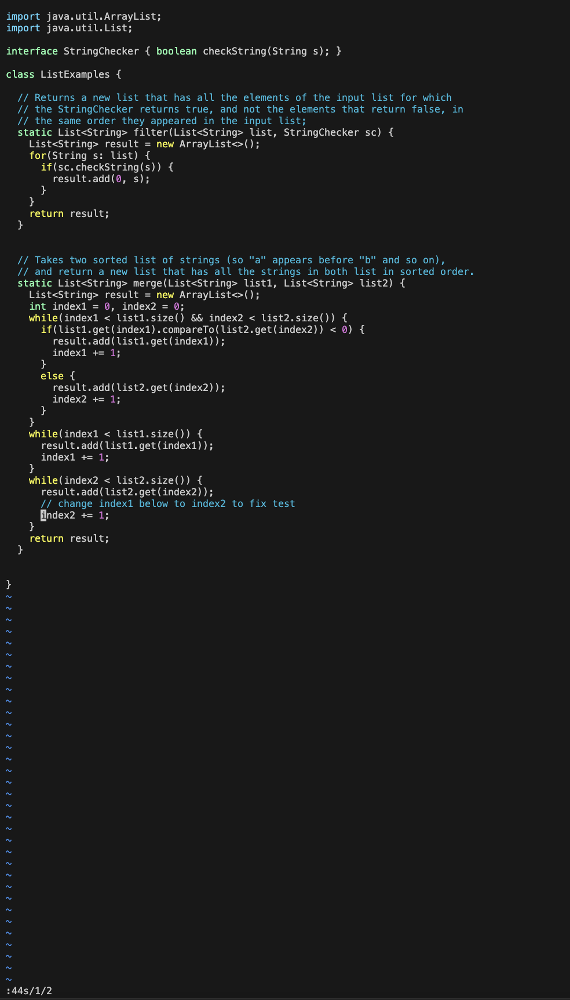
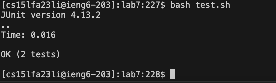
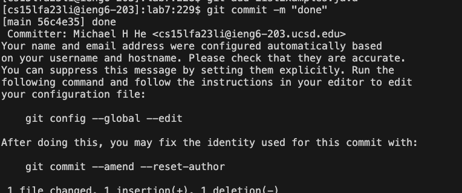
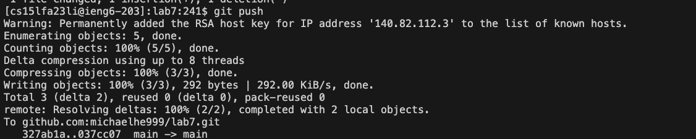

# Lap Report 4

## Step 4


## Step 5


## Step 6






## Step 7



## Step 8


## Step 9




```
<up><enter> (The ssh cs15lfa23li@ieng6.ucsd.edu command was 1 up in search history, so I used the up arrow to access it).
git clo<tab> <ctrl + v><enter> (I copied the git link earlier; the entire command is git clone https://github.com/michaelhe999/lab7.git)
cd l<tab><enter> (This changes directories to lab7/; the entire command is cd lab7/)
vi test.sh (Creates a new file test.sh with vim)
i (Insert mode)
<ctrl + c> <ctrl + v> (Copy and paste #!/bin/bash  javac -cp .:lib/hamcrest-core-1.3.jar:lib/junit-4.13.2.jar *.java java -cp .:lib/hamcrest-core-1.3.jar:lib/junit-4.13.2.jar org.junit.runner.JUnitCore ListExamplesTests)
:wq <enter> (saves and exits)
bash t<tab> (runs test.sh)
vi L<tab>.<tab><enter> (vi ListExamples.java; opens ListExamples.java in vim)
:44s/1/2<enter> (Goes to line 44, finds the first 1 and replaces it with a 2)
:wq<enter> (Saves and quits)
<up><up><enter> (Runs test.sh)
git ad<tab>L<tab><enter> (Adds ListExamples.java)
git com<tab> -m "done" (Commits changes)
git push (Pushes changes)

```
