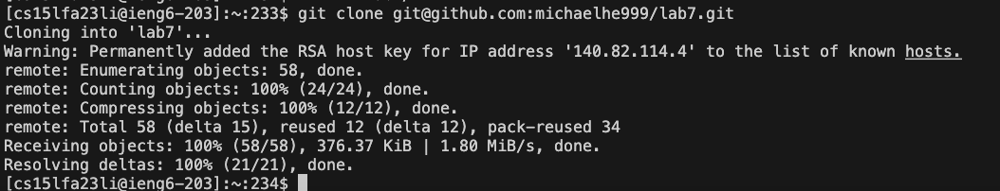

# Lap Report 4

## All commands run: 

### Step 4
```
<up><enter>
```

The ssh cs15lfa23li@ieng6.ucsd.edu command was 1 up in search history, so I used the up arrow to access it. The ssh command switches the connection to the UCSD account. It is accessed by going up in the command prompt. 

### Step 5
```
git clo<tab> <ctrl + v><enter> 
```

I copied the git link earlier; the entire command is git clone git@github.com:michaelhe999/lab7.git. git clone clones from the Github repository. Since the link was copied earlier, it can be pasted. 

### Step 6
```
cd l<tab><enter> 
vi test.sh
<i>
<ctrl + c> <ctrl + v> (#!/bin/bash  javac -cp .:lib/hamcrest-core-1.3.jar:lib/junit-4.13.2.jar *.java
java -cp .:lib/hamcrest-core-1.3.jar:lib/junit-4.13.2.jar org.junit.runner.JUnitCore ListExamplesTests)
:wq <enter> 
bash t<tab> 
```


The first command changes directories to lab7/; the entire command is cd lab7/. The next command creates a new file test.sh with vim. I then enter insert mode with <i>. I then copy text from a document saved on my computer into the vim editor, #!/bin/bash  javac -cp .:lib/hamcrest-core-1.3.jar:lib/junit-4.13.2.jar *.java java -cp .:lib/hamcrest-core-1.3.jar:lib/junit-4.13.2.jar org.junit.runner.JUnitCore ListExamplesTests. This will compile and run the test file. Then, :wq saves and exits the vim editor. Finally, bash test.sh (the full command) runs the test file. This saves time overall. 

### Step 7
```
vi L<tab>.<tab><enter> 
:44s/1/2<enter> 
:wq<enter> 
```


The full command run is vi ListExamples.java; this opens ListExamples.java in vim to be edited. The next command :44s/1/2< goes to line 44, finds the first 1 and replaces it with a 2. Finally, :wq saves and exits vim. 

### Step 8
```
<up><up><enter> 
```

This runs bash test.sh again, which runs the test file again (compiles the files, runs the files). 

### Step 9
```
git ad<tab>L<tab><enter> 
git com<tab> -m "done" 
git push 
```


This adds the changed file to the files to be committed (git add ListExamples.java, commits the file to Github with the "done" message, and pushes it to Github. 


