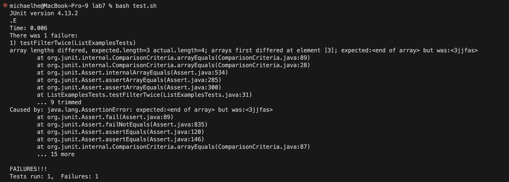
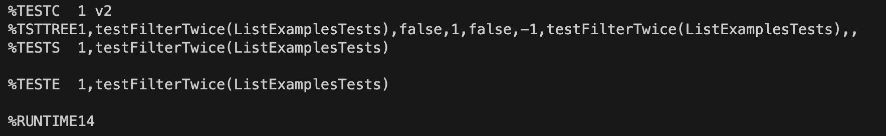
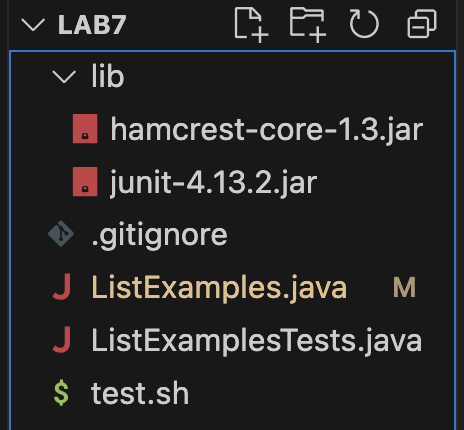

# Lab Report 5

## Part 1 – Debugging Scenario
Design a debugging scenario, and write your report as a conversation on EdStem. It should have:

### The original post from a student with a screenshot showing a symptom and a description of a guess at the bug/some sense of what the failure-inducing input is. 
(Don’t actually make the post! Just write the content that would go in such a post)

Hi! I've been having a problem with my code. When I ran my test case for my filter function, I came up with the following result: 

I think the input that causes this error is the fact that there is an entry that should be filtered out right after another entry that should be filtered out, 
but I can't understand why my code would lead to this happening. I am guessing this because where it expects the end of the array, there's another element, `<3jjfas>`, which directly follows `<kjashf2>`, which was removed

### A response from a TA asking a leading question or suggesting a command to try (To be clear, you are mimicking a TA here.)

Hi. Since your function is meant to modify the original input list, how is your loop structured to go through the list to remove each entry? It seems like there could be a problem there. 

### Another screenshot/terminal output showing what information the student got from trying that, and a clear description of what the bug is.

Thank you for the help! I found the bug: Like you said, the main issue is that the function modifies the original input list, so removing an element from it essentially made it skip over the next element. 
Also with the help of your advice, I noticed that my test case was flawed because since the function modifies the original input list, further operation on it modifies the already modified list. 


### At the end, all the information needed about the setup including:

#### The file & directory structure needed

Folder: lab7 contains: 

> Folder: lib, which contains hamcrest-core-1.3.jar and junit-4.13.2.jar

> .gitignore (from git clone)

> ListExamples.java

> ListExamplesTests.java

> test.sh



#### The contents of each file before fixing the bug

##### ListExamples.java: 

```
import java.util.ArrayList;
import java.util.List;

interface StringChecker { boolean checkString(String s); }

class ListExamples {

  // Filters the input list to have only the elements of the input list for which
  // the StringChecker returns true, and not the elements that return false, in
  // the same order they appeared in the input list;
  static List<String> filter(List<String> list, StringChecker sc) {
    for(String s: list) {
      if(!sc.checkString(s)) {
        list.remove(s);
      }
    }
    return list;
  }
}
```

##### ListExamplesTests.java

```
import static org.junit.Assert.*;
import org.junit.*;
import java.util.*;
import java.util.ArrayList;


public class ListExamplesTests {
	
	@Test(timeout = 500)
	public void testFilterTwice() {
		class isUpperCase implements StringChecker{
			public boolean checkString(String s){
				if(s.charAt(0) >= 65 && s.charAt(0) <= 90){
					return true;
				}
				return false;
			}
		}

		class containsNumber implements StringChecker{
			public boolean checkString(String s){
				for(int i = 0; i < s.length(); i++){
					if(s.charAt(i) >= 48 && s.charAt(i) <= 57){
						return true;
					}
				}
				return false;
			}
		}
    	List<String> l1 = new ArrayList<String>(Arrays.asList("Abc", "BCd", "C3r5u=", "kjashf2", "3jjfas"));
	assertArrayEquals(new String[]{ "Abc", "BCd", "C3r5u="}, ListExamples.filter(l1, new isUpperCase()).toArray());
	assertArrayEquals(new String[]{ "C3r5u=", "kjashf2", "3jjfas"}, ListExamples.filter(l1, new containsNumber()).toArray());
	}	
}
```
##### test.sh
```
javac -cp .:lib/hamcrest-core-1.3.jar:lib/junit-4.13.2.jar *.java
java -cp .:lib/hamcrest-core-1.3.jar:lib/junit-4.13.2.jar org.junit.runner.JUnitCore ListExamplesTests
```

#### The full command line (or lines) you ran to trigger the bug

`bash test.sh`

#### A description of what to edit to fix the bug

The first fix is to either change the function to first have an empty ArrayList that is filled with valid entries and then set to be the inputted List, 
or to increment through the List and decrement the step by 1 every time an element is removed. I chose the second fix because it's more fun. This changes the loop from: 
```
for(String s: list) {
      if(!sc.checkString(s)) {
        list.remove(s);
      }
    }
```
to: 
```
for(int i = 0; i < list.size(); i++) {
      if(!sc.checkString(list.get(i))) {
        list.remove(i);
        i--;
      }
    }
```
The second issue to fix is that the test case is written wrong, in that the expected value is incorrect. To fix this bug, all that is needed is to change the wrong expected value to the actual expected value. 
Instead of `{ "C3r5u=", "kjashf2", "3jjfas"}` being the expected List, it should actually be `{"C3r5u="}`

## Part 2 – Reflection
In a couple of sentences, describe something you learned from your lab experience in the second half of this quarter that you didn’t know before. It could be a technical topic we addressed specifically, something cool you found out on your own building on labs, something you learned from a tutor or classmate, and so on. It doesn’t have to be specifically related to a lab writeup, we just want to hear about cool things you learned!

In the last half of the quarter for CSE 15L, my main takeaway has been how intuitive and easy the tools that I previously thought were hard to use actually are. The main examples of this are vim and Java Debugger. Vim turned out to be an extremely easy and efficient way for a programmer to access files through only the terminal, with simple-to-remember shortcuts and intuitive steps. I also found that vim is especially useful on files that you know well, as you can easily navigate to certain lines with the :line-number shortcut. 

I also learned how to use Java Debugger, a useful tool that I previously didn't understand. Before, me testing my CSE 12 code involved stepping through each line of code until I spotted an issue, whereas with JDB being able to output the current values of variables made finding issues a lot easier. 
